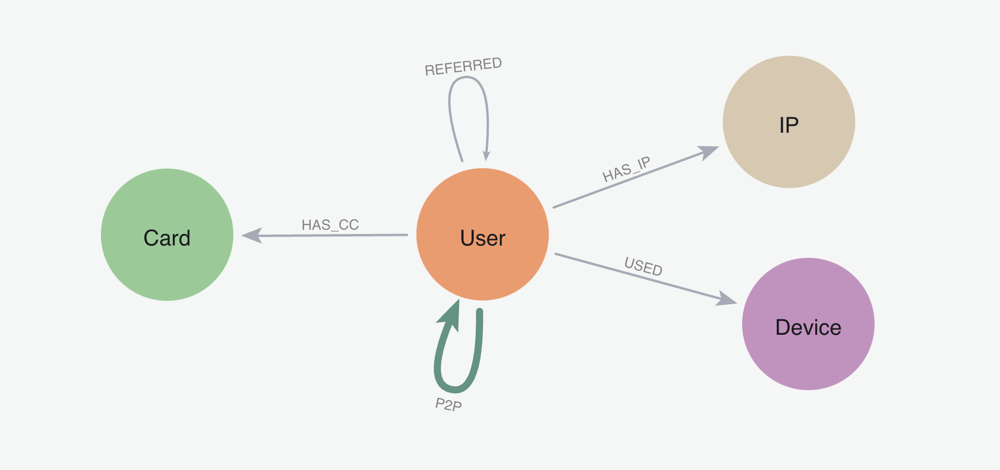

# Snowflake Graph Analytics
## Worked Example: Entity Resolution & Fraud Detection

This example shows how to use Neo4j Graph Analytics within Snowflake to analyze your data, in this case focusing on peer-to-peer (P2P) financial transaction data. Specifically, this example shows how to: 
1. Identify user clusters - i.e. __customer segmentation__ (graph algo: louvain community detection)
2. __Find the most influential users__: who has the most money flowing through their account (graph algo:pagerank centrality)
3. Perform __entity resolution__ & identify fraud risk accounts (graph algo: weakly connected components)

### Video Reference
See a recorded demo of this example [here (starting at 12:00)](https://www.youtube.com/watch?v=BiTA9OXHM44&t=708s)

## Dataset
The P2P Dataset has the below schema with users sending money to each other in P2P transactions.  Each user can also have multiple identifiers, including credit cards, devices, and IP addresses.

## Prerequisites:
### 1) Make sure you have the Neo4j Graph Analytics App installed from the marketplace listing.

### 2) Get the data
1. In snowflake, create a database called `P2P_DEMO`
2. Upload all 3 csvs from [here](https://drive.google.com/drive/folders/1BnAnRSEfuwDvc4eQH8IRvy3tUkwOeaNf?usp=sharing) as tables under public schema. You should have three tables.  
   1. `P2P_USERS`: Make sure to use type `FLOAT` for FRAUD_TRANSFER_FLAG, IP_COUNT, CARD_COUNT & DEVICE_COUNT. 
   2. `P2P_TRANSACTIONS`
   3. `P2P_TRANS_W_SHARED_CARD`
3. Run [P2P_DEMO_STEP0_CREATE_AGG_TABLE.sql](P2P_DEMO_STEP0_CREATE_AGG_TABLE.sql)  to create a `P2P_AGG_TRANSACTIONS` table. This just aggregates transactions for efficiency later on. 

## Running The Example

### Steps
1. Run [P2P_DEMO_STEP1_ALGOS.sql](P2P_DEMO_STEP1_ALGOS.sql) This will run all the graph algorithms and create all table for the entire worked example
2. Run the notebook [P2P_DEMO_STEP2_EXPLORE.ipynb](P2P_DEMO_STEP2_EXPLORE.ipynb) to visualize clustering and influential/high-money-flow account analysis
3. Run the notebook [P2P_DEMO_STEP3_ER.ipynb](P2P_DEMO_STEP3_ER.ipynb) to visualize the ER and additional fraud risk labeling analysis. 